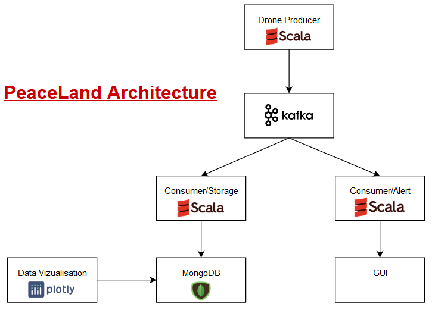

# Data-Engineering-Project

Project members : 

- BAGORIS Emeline
- BEAUFILS Vincent
- BOERSMA Hélène

<<<<<<< Updated upstream

=======
>>>>>>> Stashed changes

Preliminary questions :

1a) What technical/business constraints should the data storage component of the program architecture meet to fulfill the requirement described by the customer in paragraph «Statistics» ?
Constraints :
- Stock data over a long period of time
- Handle huge loads of data (200Gb per day)
- Flexible db as they don’t know what they want to do with it
- Reliable

1b) So what kind of component(s) (listed in the lecture) will the architecture need?
- One distributed storage (MongoDB)
- Distributed stream (Kafka Streams API)
- Two stream consumer (peacemaker who receive alerts + statistician)

2) What business constraint should the architecture meet to fulfill the requirement describe in the paragraph «Alert»

Constant detection and supervision + Real-time alert, as quick as possible
Speed is more important than accuracy

3) What mistake(s) from Peaceland can explain the failed attempt?

Unappropriate storage or processing as well as computer crash and human mistake.
Latency in the processing can also explain failure to handle alert in time.

4) Peaceland has likely forgotten some technical information in the report sent by the drone. In the future this information could help Peaceland make its peacewatchers much more efficient. Which information?
Each drone make a report every minute with :
- Drone Id
- Drone location (latitude, longitude)
- Name of surrounding citizen using facial recognition with their computed «peacescore»
- Conversations records 
- Datetime 
- Nature of the incident 

Project :

attention le sbt build ne fonctionne pas
package scala src